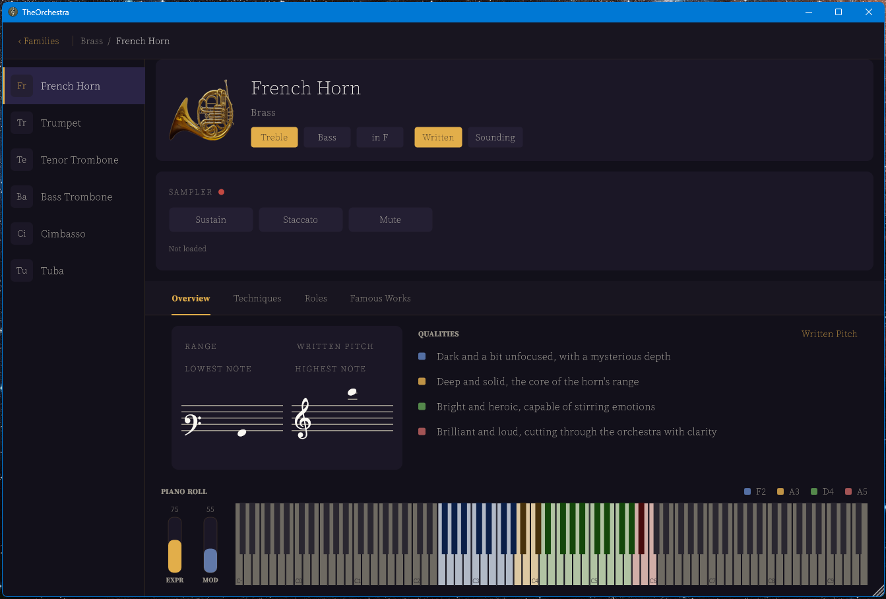
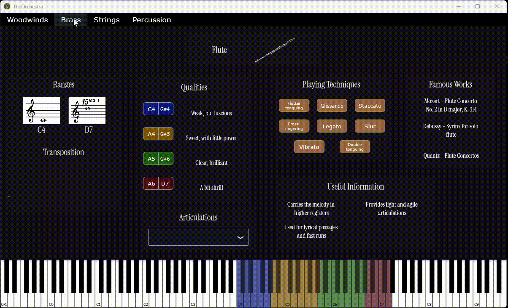

# The Orchestra
[](https://github.com/Diversiam90815/Chess-Engine/actions/workflows/windows.yml)
[](https://github.com/Diversiam90815/Chess-Engine/actions/workflows/macos.yml)
[](https://github.com/Diversiam90815/Chess-Engine/actions/workflows/linux.yml)
[](https://github.com/Diversiam90815/Chess-Engine/actions/workflows/tests.yml)
[](https://github.com/Diversiam90815/Chess-Engine/actions/workflows/static-analysis.yml)
[](LICENSE)
[](https://en.cppreference.com/w/cpp/20)
[](https://juce.com)

**The Orchestra** is a C++20 / JUCE desktop application for studying the instruments of the symphony
orchestra. Pick a family, pick an instrument, and see its range on a real staff, its registers coloured
along a piano roll, the techniques it supports, the roles it plays, and the repertoire it is known for,
then play it back from the sampler with your MIDI keyboard.

It is built as an orchestration reference that you can hear, rather than one you only read.


## Showcase

### Image Preview


### Demo Video



## Features

### Instrument catalogue
- JSON-driven data for 22 instruments across Woodwinds, Brass, Strings and Percussion
- Family-level playing techniques with per-instrument overrides
- Per instrument: written and sounding ranges, registers with timbral descriptions, orchestration roles,
  signature works, supported clefs
- Deterministic 3-digit lookup key encoding family and instrument (e.g. `301` = Violin)

### Notation
- Staves drawn programmatically from a SMuFL font (Bravura)
- Treble, bass, alto and tenor clefs, with automatic selection of whichever keeps a note closest to the staff
- Ledger lines, and automatic `8va` / `8vb` / `15ma` / `15mb` escalation for extreme notes
- Written-vs-sounding toggle for transposing instruments, with the transposition named (`in Bb`, `in F`, …)

### Audio & MIDI
- JUCE `AudioProcessor` + `AudioProcessorEditor` architecture, hosted by a standalone shell
- Multi-sampled playback with round-robin and velocity layers, per articulation
- On-screen piano roll with registers colour-coded across the keys and the playable span highlighted
- All available MIDI inputs enumerated and enabled at startup
- MIDI CC sliders that both send and reflect controller state


## Architecture

Three static libraries with a strictly one-way dependency:

```
┌─────────────────┐
│  OrchestraApp   │  Standalone shell: window, audio device, MIDI routing
└────────┬────────┘
         │
┌────────▼────────┐
│  OrchestraUI    │  JUCE components, design tokens, notation rendering
└────────┬────────┘
         │
┌────────▼────────┐
│ OrchestraCore   │  Domain model, sampler, file & config management
└─────────────────┘
```

**`OrchestraCore`** owns the domain and knows nothing about the UI: the instrument catalogue
(`InstrumentController`), the sampler (`OrchestraSampler` / `OrchestraVoice` / `SamplesManagement`),
path and config resolution (`FileManager`, `UserConfig`), and logging.

**`OrchestraUI`** talks to the domain through exactly one seam: `CoreManager`. No component holds a
back-pointer to its parent; panels expose `std::function` callbacks and the editor wires them up. That
keeps every panel independently constructible and testable.

**`OrchestraApp`** is a thin `Main.cpp`: it creates the processor and editor, opens the audio device and
routes MIDI. The same editor is created by `OrchestraProcessor::createEditor`, so the UI is not coupled to
the standalone host.

### Design system

The UI is built on a small set of shared primitives rather than per-component styling:

- **`Theme.h`** is the single source of truth for the palette, spacing scale, type scale, corner radii and
  chrome heights. Components resolve it via `themeFor(*this)`; nothing hardcodes a colour.
- **`OrchestraPanel`** is the base class for every panel: rounded surface, optional uppercase title, and a
  consistent content area inset.
- **`HasPreferredHeight`** lets a panel report the height it needs for a given width. The detail view sums
  these to size its scroll content, so panels grow with their text instead of being clipped or padded to a
  guessed height.
- **`GridFlow`** implements one responsive column rule shared by every card grid.
- **`TextMeasure`** wraps JUCE text measurement so panels can size themselves to real text metrics.
- **`CustomLookAndFeel`** paints labels and buttons from typed `LabelStyle` / `ButtonStyle` tags rather than
  from stringly-typed component names.


## Building

### Prerequisites

- CMake 3.25+
- A C++20 compiler
- Python 3.10+ (for the build script)
- Git

Dependencies (JUCE 8.0.3, nlohmann/json, GoogleTest and the logger) are fetched automatically by
[CPM](https://github.com/cpm-cmake/CPM.cmake) into `libs/cpm-cache` on first configure.

### Platform support

Developed and tested on **Windows** with MSVC. The CMake now guards its MSVC-only compiler flags and all
filesystem paths resolve through JUCE's cross-platform APIs, so a macOS or Linux build is expected to work.

### Quick start

```bash
python build.py -b
```

Or drive CMake directly:

```bash
cmake -S . -B build -G Ninja && cmake --build build && ctest --test-dir build --output-on-failure
```

### Build script arguments

| Argument | Short | Description | Default |
|---------|--------|-------------|---------|
| `--prepare` | `-p` | Generate CMake build files only (no build). | `False` |
| `--build` | `-b` | Generate, build, then run the test suite. | `False` |
| `--platform` | `-pl` | CMake generator (`Ninja`, `VS2022`, `VS2026`). | `Ninja` |
| `--architecture` | `-a` | Target architecture (`x64`, `ARM64`). | `x64` |
| `--configuration` | `-c` | Build configuration (`Debug`, `RelWithDebInfo`, `Release`). | `Release` |
| `--runtest` | `-t` | Run the test suite against an existing build. | `False` |

Examples:

```bash
python build.py -b -pl VS2022 -c Debug
```

```bash
python build.py -t -c Debug
```

Build output lands in `build/<architecture>/`, e.g. `build/x64/`. Installs go to `install/`.

### Optional tooling

All off by default, so a fresh clone configures without any of them installed:

| Option | Effect |
|--------|--------|
| `-DENABLE_FORMAT=ON` | Run clang-format over the sources before each build |
| `-DENABLE_CPPCHECK=ON` | Run cppcheck static analysis on the C++ targets |
| `-DENABLE_DOXYGEN=ON` | Add a Doxygen documentation target |
| `-DENABLE_MEMCHECK=ON` | Add a memcheck target |


## Tests

GoogleTest, discovered by CTest, split by the library under test:

- **`OrchestraCore.Tests`**: instrument parsing and lookup, range and register modelling, sampler voice
  and sound behaviour, sample-file management, file/path resolution, and `CoreManager` integration.
- **`OrchestraUI.Tests`**: the UI logic that needs no window: `GridFlow`'s column and row arithmetic, and
  `NotationGeometry`'s staff placement, ottava escalation and transposition naming.

```bash
ctest --test-dir build/x64 -C Debug --output-on-failure
```


## Samples

The sample library lives in `Assets/Samples/` and is copied next to the executable at build time, so the
app finds it without an install step. You can point the app at a different sample folder from the settings
control on the family switcher; the choice is persisted via `UserConfig`.

> **Note:** the sample pack is currently committed to the repository and is roughly 1.3 GB, which makes
> cloning slow.


## Repository layout

```
Assets/          Instrument JSON, fonts, images, samples
cmake/           Build modules (options, build info, tooling integrations)
scripts/         Python build helpers used by build.py
src/
  OrchestraCore/ Domain model, sampler, file & config management
  OrchestraUI/   Components, theme, notation rendering
  OrchestraApp/  Standalone application shell
tests/           GoogleTest suites, mirroring the src/ split
```


## License

MIT — see [LICENSE](LICENSE).
