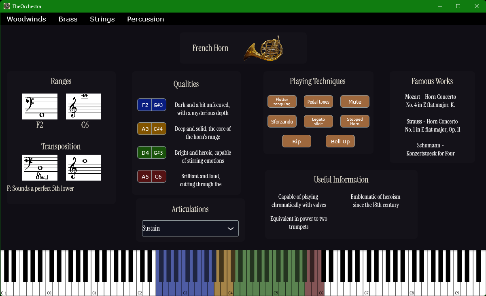

# The Orchestra

Welcome to **The Orchestra**. This C++ application serves as an introductory guide for orchestral instruments! 
It is designed to help you explore and understand the diverse sounds and capabilities of orchestral instruments. Whether you're a newcomer to orchestration or an entry-level composer, this app provides a comprehensive overview of different instruments, with additional information such as
- their total range, 
- their qualities or sub ranges, 
- some historical context,
- the most common playing techniques and style,
- and examples of compositions where they are prominently featured. 

Additionally, it includes basic sampling functionalities using a MIDI keyboard to enhance your learning experience. (Though not all instruments are available as of now)


## Prerequisites

- **C++ Compiler**: Compatible with C++20 or higher.
- **CMake**: Version 3.15 or higher.
- **Git**: For cloning the repository.
- **Python**: Version 3.x (for running `build.py`).


## Features

- **Instrument Information**: Detailed descriptions of various orchestral instruments, including their history, technical details, and roles in the orchestra.
- **MIDI Sampling**: Use a MIDI keyboard to listen to and experiment with the sounds of different instruments.
- **Composition Examples**: Examples of compositions featuring different instruments to illustrate their typical use cases and highlight their versatility.
- **Continuous Updates**: New features and instruments are regularly added as this project is still in development.


## Getting Started

### Cloning the Repository

Clone the repository including:

```bash
git clone git@github.com:Diversiam90815/TheOrchestra.git
```

Keep in mind that you also need to check out the submodules with this project. To do so, you can include --recurse-submodules within the clone command (with git version 2.13 or higher):

```bash
git clone --recurse-submdules git@github.com:Diversiam90815/TheOrchestra.git
```

or if you already cloned the repository call

```bash
git submodule update --init --recursive
```


### Build Instructions

#### Prepare the Build Environment

Before building the project, you need to generate the necessary build files using CMake. This can be done using the `build.py` script with the `--prepare` or `-p` option. The target build configuration can be adjusted in the build.py file: Currently it is set to build a Visual Studio 2022 project.

```bash
cd TheOrchestra
python build.py -p
```

For a **Debug** build, add the `--debug` or `-d` option:

```bash
python build.py -pd
```

#### Build the Project

To build the project, use the `--build` or `-b` option:

```bash
python build.py -b
```

This will compile the project using the build files generated during the preparation step.

- **Release Build**: By default, the build is configured for a Release build.
- **Debug Build**: To build the project in Debug mode, include the `--debug` or `-d` option:

  ```bash
  python build.py -bd
  ```

**Important**: You do not need to run the `--prepare` step separately, the script will automatically prepare the build environment before building.


### Running the Plugin

After a successful build, the application can be found in the build output directory. Currently, the app is set to build standalone executable binary. They can be found within the respective folder.


## Roadmap
- **Notation and Score Viewing**: Add features for viewing and interacting with musical scores, including playback functionality, annotation capabilities, and synchronization with MIDI inputs for real-time score following.


## Showcase

### Image Preview


### Demo Video


---

Thank you for using The Orchestra! I hope it helps you on your journey to mastering orchestration.
